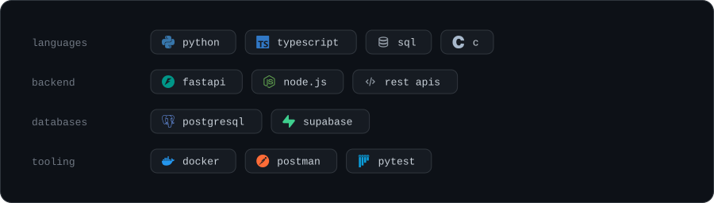

<div align="center">



<br>

**Backend developer building APIs and data-driven services with Python, FastAPI and PostgreSQL.**

[Email](mailto:gabrielbarretoxyz@gmail.com)
 · [LinkedIn](https://www.linkedin.com/in/gabriel-barreto-a662ab290)

</div>

---

### about

```text
focus      backend development with python
approach   learn by building: api, database and deploy, end to end
open to    junior backend and software developer roles
```

### stack



### contact

**gabrielbarretoxyz@gmail.com**

<div align="center">


</div>
